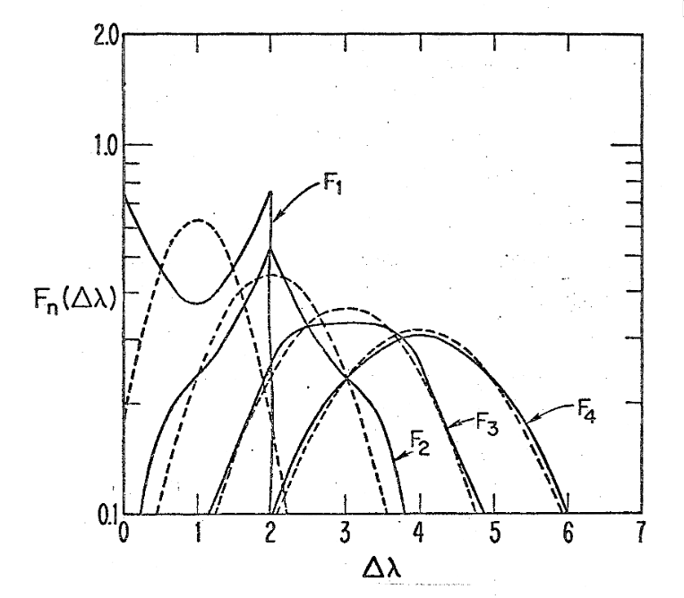

# An introduction to debugging (in Python)

This code calculates successive Compton scatterings in the Thomson limit using equations derived in Ross (1978). It reproduces the solid curves of this figure:

<p align="center">

</p>

But oh no! What's this, the code fails immediately with errors?

```
$ python cross_section.py
Traceback (most recent call last):
  File "/home/lilith/Developer/intro-to-debugging-in-python/cross_section.py", line 71, in <module>
    fs = spectral_distribution(dlambda, 4)
                               ^^^^^^^
NameError: name 'dlambda' is not defined. Did you mean: 'd_lambda'?
```

Oh deary me! If only there were some kind of methodology that could help me debug these gruesome bugs!

## An approach

The principle method of debugging is summarised best in the GNU debugger (`gdb`) manual page
```
 GDB can do four main kinds of things (plus other things in support of these) to help you catch bugs in the act:

 •   Start your program, specifying anything that might affect its behavior.

 •   Make your program stop on specified conditions.

 •   Examine what has happened, when your program has stopped.

 •   Change things in your program, so you can experiment with correcting the effects of one bug and go on to learn about another.
```

There are a number of different types of bugs you may encounter. Here are some in reverse order of severity:

- _Interpreter / compiler / compile-time errors_

  These are normally the friendliest kind of bug, as the compiler does its best to let you know what has gone wrong and where. Familiarity with the language and the operating system are key here for finding the solutions, but tools like linters and static analysers can help you avoid making these mistakes in the first place.

- _Runtime exceptions_

  Runtime exceptions are "known errors" that occur during program execution. In many cases, these (can be made to) generate a stack trace, that gives some context of what happened and why. Debugging tools are here useful for quickly discovering what triggered the exception.

- _Runtime failures_

  These are distinguished from _exceptions_ as they normally do not generate stack traces or other useful bits of information. Examples include the infamous `segfault` or `DBUS error`, and are usually caused by a bad memory access which the operating system has detected and subsequently killed your program for its misdemeanor. Debugger tools are here invaluable, as are memory sanitizers and profilers.

- _Logical / numerical errors_

  Without a doubt the most feared error to encounter; no error message, no unusual behaviour in the execution, but your results are wrong. Debugging these kinds of errors are often nightmares, and are best tackled by narrowing down where the logical fault has occurred, by, for example, removing code branches that are not executed, and pulling the code apart.

## A short `pdb` cheatsheet

`pdb` ([link to docs](https://docs.python.org/3/library/pdb.html)) is the Python DeBugger. It comes with (almost all) modern Python distributions, and is an extremely helpful little tool for not only debugging, but for learning what a code is doing in the first place.

There exist a number of graphical tools that wrap `pdb` and can make your life easier, but these will not always be available. In almost all cases, however, you will be able to access at least a command line, and get to work trying to discover what went wrong.

Annotate your code with `breakpoint()` built-in functions. When these are hit, the execution flow is interrupted, and a debugger shell is spawned in the running terminal, prefixed by `(Pdb)`.

```
$ python cross_section.py
> /home/lilith/Developer/intro-to-debugging-in-python/cross_section.py(73)<module>()
-> fs = spectral_distribution(dlambda, 4)
(Pdb)
```

> :warning: Remember, you can always modify the source code, and set `breakpoint()` conditionally!

At this point, you can inspect, modify, step through, and navigate the code, and set various watch points and catches to help you find what's going wrong in the first place.

Another way to get into the `pdb` shell is to use the _post-mortem_ mode. This collects the most recent stack trace that an exception generated, and lets you look at the call hierarchy and arguments to help discover what went wrong:

```
In [1]: %run cross_section.py
---------------------------------------------------------------------------
Exception                                 Traceback (most recent call last)
...

Exception: Oh no!

In [2]: import pdb; pdb.pm()
> /home/lilith/Developer/intro-to-debugging-in-python/cross_section.py(73)my_function()
-> raise Exception("Oh no!")
(Pdb)
```

### Stack frames

    w(here)         # where am i
    d(own)          # down a frame (optionally takes an argument for number)
    u(p)            # up

### Inspection

    l(ist) [first[, last]]   # list the source code for the current file
                             # without arguments lists 11 lines around current line
    a(rgs)                   # print the arguments of current function

    p expression             # evaluate and print result of an expression
    pp expression            # like `p` but pretty print
    whatis expression        # get type of the expression result
    source expression
    display [expression]     # display the value of `expression` if it changed, each time
                             # execution stops in the current frame
    interact

### Execution

    s(tep)
    n(ext)
    unt(il) [lineno]
    r(return)            # continue until a return is evaluated
    j(ump) lineno        # set the next line that will be executed

### Breakpoints

    b(reak) [([filename:]lineno | function) [, condition]]
    enable bpnumber
    disable bpnumber
    ignore bpnumber
    condition bpnumber [condition]

## Avoiding bugs in the first place

Having listed some of the bugs you might encounter above, it would be remiss to not discuss a general strategy for avoiding these errors in the first place. As hinted, static analysis tools are excellent for avoiding common, programmatically detectable mistakes, however the most useful thing you can do is have a comprehensive test suite.

It is much easier to confirm the behaviour of a function or section of your code if you can test and check it in isolation, and a good test suite will do precisely that. If you encounter a logical error, the test suite will likely give you a very good indication of where to start looking.

Once you have found the bug, make sure you **record the input as a new test** in your test suite, to avoid that bug ever occurring again. As you are pulling your code apart, it is also an excellent practice to add new unit tests to your test suite to solidify the expected behaviour of your code.

Another very sensible approach that can help you debug programs is consistent logging. Python has an excellent builtin [logging package](https://docs.python.org/3/howto/logging.html) that lets you set the severity of the log (debug, info, warn, error, fatal). Log levels can be change (in Python even dynamically) to change the verbosity of your program.

